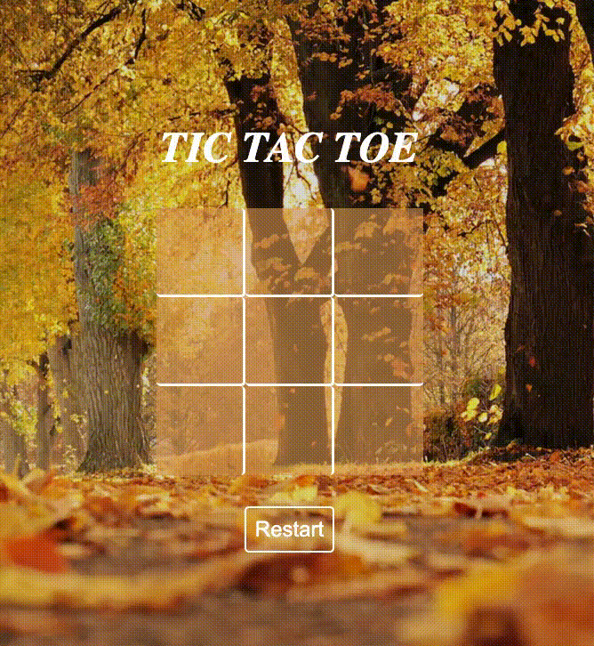

# Tic Tac Toe Game

<b>Link to project: </b><a href="https://ramosy1.github.io/tictactoe_game/">Tic Tac Toe Game</a>

## Overview

<b>Tech used: </b>HTML, CSS, and Javascript.

This is a good ole classic game of Tic Tac Toe where each player gets a turn at having a straightline of either three Xs or three Os.  If a box is empty (null), the player who's turn is up can click on it and viceversa. The game has 8 possible winning combinations. Once the game is completed, the winning combo will be highlighted and the players can start a new game by clicking on the Restart button

